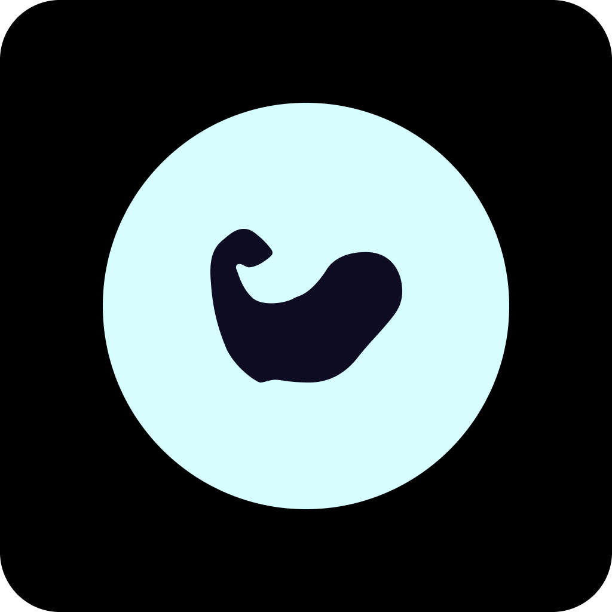
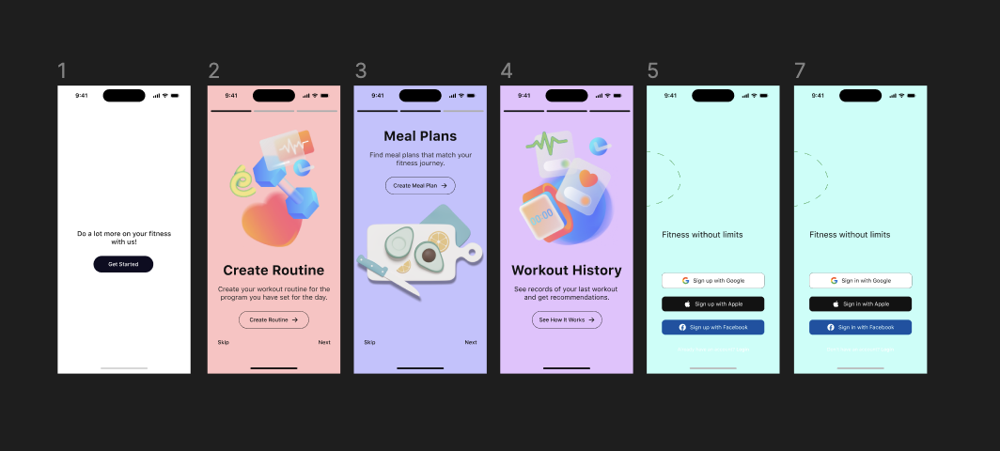
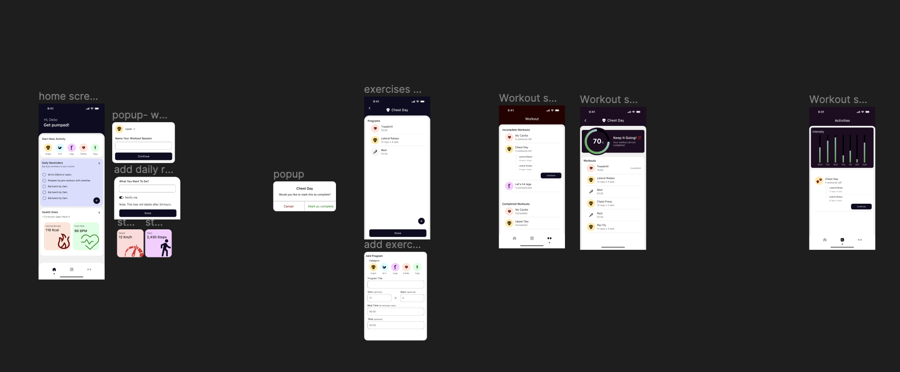

  

# Go Get It  

ℹ️ Go Get It was designed as an assistant to help people keep track of their fitness stats, create workout routines and monitor their workout progress.
It also has features that help people find new exercises to add to their  routines.
It really is a limitless app that can be as wide as it gets.

## Features
- [x] Keep track of workout routines.
- [x] Create new workout routines
- [x] Save tasks as reminders of things to do.
- [x] Monitor a workout routine progress
- [x] Search for exercises to add to routines

## Screenshots

## Installation

### Setup API Key
**Go Get It** requires an api key from Rapid API [Exercises DB API](https://rapidapi.com/justin-WFnsXH_t6/api/exercisedb?utm_source=youtube.com%2FJavaScriptMastery&utm_medium=referral&utm_campaign=DevRel) which gives it rich resources of exercises a person can add to their routine.

1. Create a .env file in the root directory of your cloned copy 
2. Create a Config.xcconfig (Configuration file) in the "Go Get It" directory
3. You'll need to add a pre-action script to load your .env file into your xcconfig file

If you need help with the above reference this [article](https://moinulhassan.medium.com/read-variables-from-env-file-to-xcconfig-files-for-different-schemes-in-xcode-3ef977a0eef8)

